# AWS 上でソース管理からデプロイまで行う

AWS のサービスを利用しつつ、下記要領でアプリケーション開発を行います：

- CodeCommit: ソース管理
- CodeBuild: コンテナイメージの作成
- ECS: アプリデプロイ
- CodePipeline: ビルド、デプロイの自動化

## CodeCommit

ソース管理を行うサービスです。マネージドサービスなのでサーバの存在を意識せずにリポジトリを使うことができます。

### やったこと

Java アプリケーションのソースファイルを管理できる状態にします。

#### リポジトリ作成

AWS のコンソール上からリポジトリを作成します。

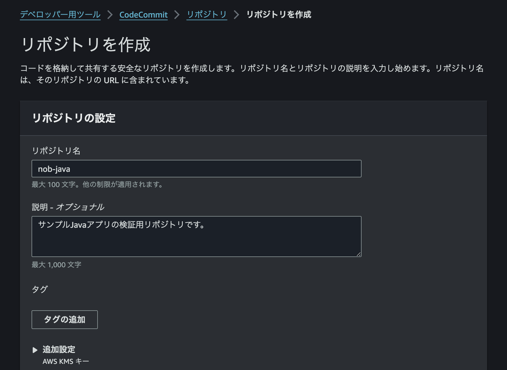

リポジトリの初期ページに、SSH キーの登録方法が記載されています。[ドキュメント](https://docs.aws.amazon.com/ja_jp/codecommit/latest/userguide/setting-up-ssh-unixes.html?icmpid=docs_acc_console_connect_np)に従ってキーを登録してクローンの準備をします。

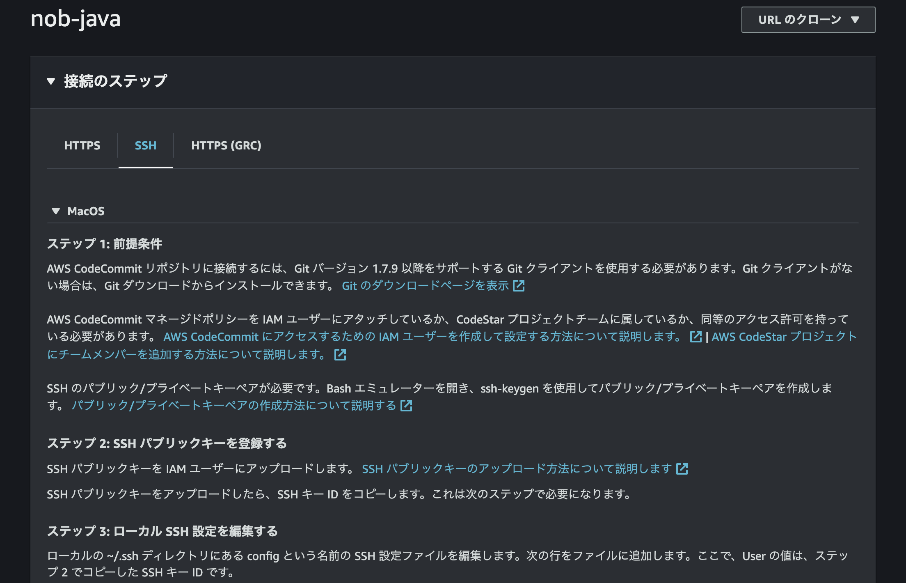

#### ソースのプッシュ

ローカルで java プロジェクトを立ち上げ、リモートリポジトリにプッシュします。`app`がアプリケーションの実体です。

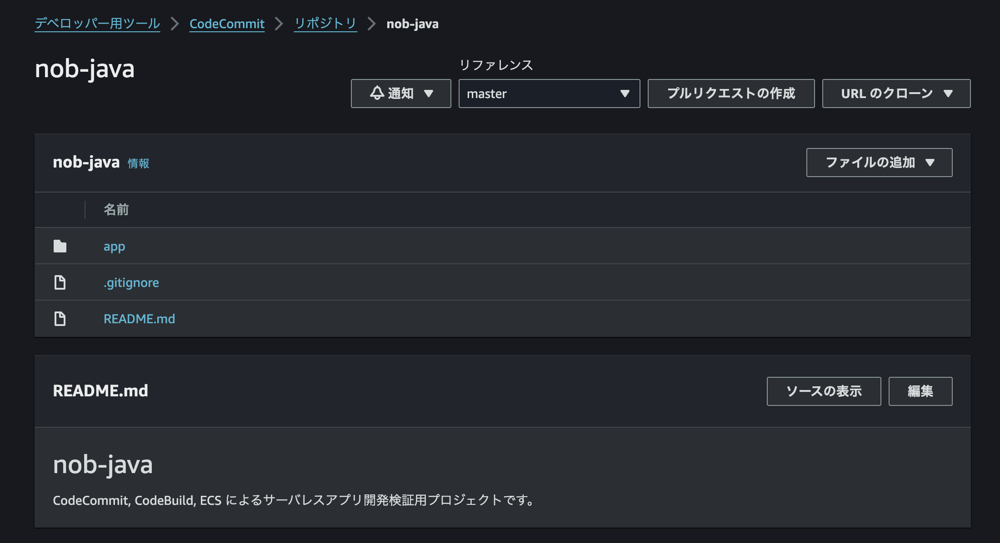

作業用ブランチを切ってサンプルメソッドの実装をしてみます。ローカルでソースを編集後、プッシュしてプルリクエストを作成します。


## CodeBuild

アプリケーションのテスト、ビルドが行えるサービスです。

### やったこと

CodeCommit 上で管理しているソースファイルからアプリのコンテナイメージをビルドし、ECR へプッシュします。

#### ECR リポジトリ作成

アプリのコンテナイメージ格納先となる ECR リポジトリを作成します。


#### プロジェクト作成

先ほどソースをプッシュしたリポジトリを紐づけて CodeBuild のビルドプロジェクトを作成します。

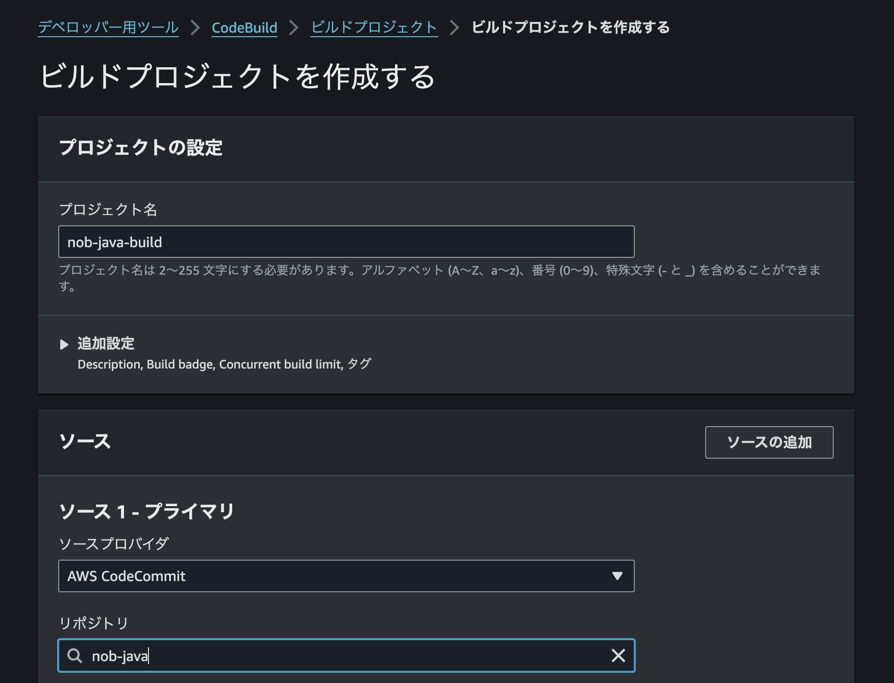

CodeBuild サービスロールにアタッチしている許可ポリシーに下記を追加して、CodeBuild から ECR に向けてイメージのプッシュができるようにします：

```json
{
    "Action": [
    "ecr:BatchCheckLayerAvailability",
    "ecr:CompleteLayerUpload",
    "ecr:GetAuthorizationToken",
    "ecr:InitiateLayerUpload",
    "ecr:PutImage",
    "ecr:UploadLayerPart"
    ],
    "Resource": "*",
    "Effect": "Allow"
},
```

また、CodeBuild の管理画面から、下記環境変数をあらかじめ設定しておきます。

| 環境変数名         | 概要                       |
| ------------------ | -------------------------- |
| AWS_DEFAULT_REGION | リージョン名               |
| AWS_ACCOUNT_ID     | アカウント ID              |
| IMAGE_TAG          | イメージタグ               |
| IMAGE_REPO_NAME    | イメージ格納先リポジトリ名 |

#### buildspec 記載

CodeBuild は`buildspec.yml`に従ってビルドを進めます。この yml をソースリポジトリのルート配下に置くことで CodeBuild が認識するようになります。

```yml
version: 0.2

phases:
  install:
    runtime-versions:
      java: corretto17
  pre_build:
    commands:
      - aws ecr get-login-password --region $AWS_DEFAULT_REGION | docker login --username AWS --password-stdin $AWS_ACCOUNT_ID.dkr.ecr.$AWS_DEFAULT_REGION.amazonaws.com
  build:
    commands:
      - mvn install -f app/pom.xml
  post_build:
    commands:
      - docker build -t $IMAGE_REPO_NAME:$IMAGE_TAG .
      - docker tag $IMAGE_REPO_NAME:$IMAGE_TAG $AWS_ACCOUNT_ID.dkr.ecr.$AWS_DEFAULT_REGION.amazonaws.com/$IMAGE_REPO_NAME:$IMAGE_TAG
      - docker push $AWS_ACCOUNT_ID.dkr.ecr.$AWS_DEFAULT_REGION.amazonaws.com/$IMAGE_REPO_NAME:$IMAGE_TAG
      - printf '[{"name":"nob-java","imageUri":"%s"}]' $AWS_ACCOUNT_ID.dkr.ecr.$AWS_DEFAULT_REGION.amazonaws.com/$IMAGE_REPO_NAME:$IMAGE_TAG > imagedefinitions.json
artifacts:
  files: imagedefinitions.json
```

上の設定ファイルでは

- pre_build: AWS ログイン
- build: Java アプリのビルド
- post_build: コンテナイメージの作成および ECR へのプッシュ、および CodePipeline 用のアーティファクト作成

を行っています。`imagedefinitions.json`は ECS のサービス更新に必須です。下記 Dockerfile を使ってイメージをビルドします：

```
FROM openjdk:17

COPY app/target/app-0.0.1-SNAPSHOT.jar /java/jar/app-0.0.1-SNAPSHOT.jar

CMD java -jar /java/jar/app-0.0.1-SNAPSHOT.jar
```

#### ビルド実行

「ビルドを開始」ボタンを押下します。ビルドに成功すると ECR リポジトリにイメージがプッシュされます。

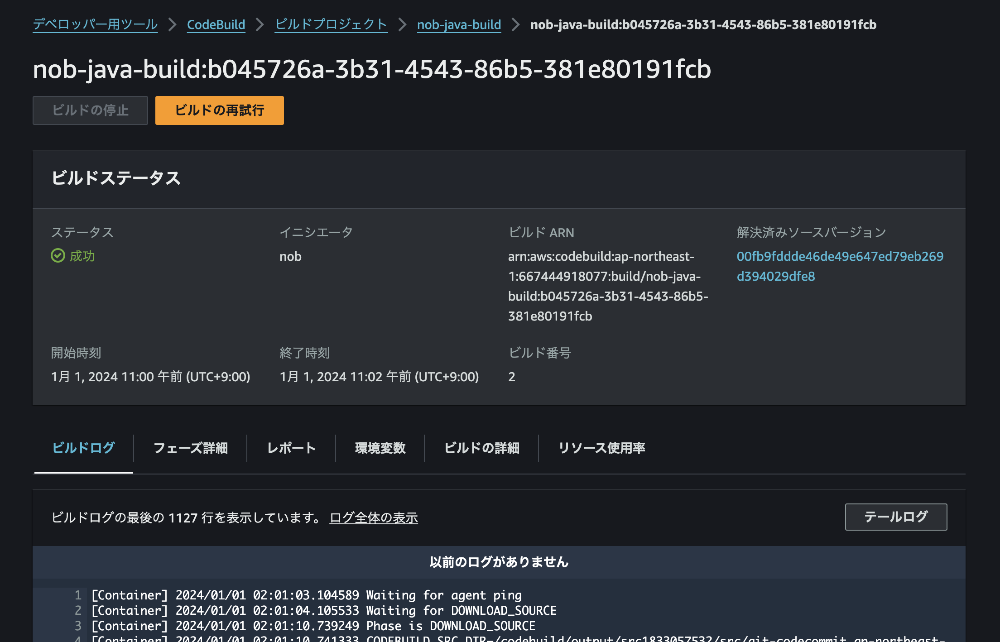

ECR のリポジトリ上で、指定したタグでイメージが作られていることが確認できます。

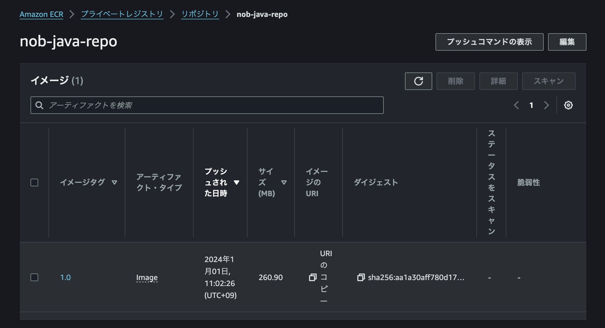

## ECS

コンテナアプリケーションをデプロイできるサービスです。

### やったこと

ECR 上のイメージを使ってアプリケーションをデプロイ、疎通確認を行います。

#### サービス作成

クラスターを作成します。クラスターはコンテナを実行する EC2 インスタンスの管理単位です。

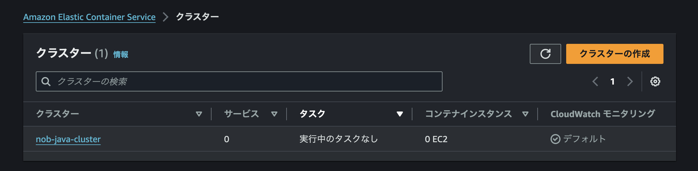

タスク定義を作成します。タスクは実行対象のコンテナイメージとその実行設定とをセットにした概念です。

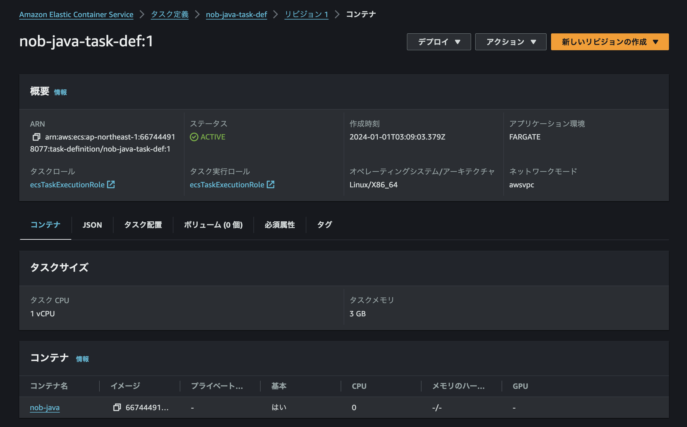

サービスを作成します。サービスは実行されるコンテナそのものを指す概念です。上で作成したタスクを指定し、起動する VPC などを設定します。「デプロイ不具合の検出」で「Amazon ECS デプロイサーキットブレーカーを使用する」のチェックを外さないとエラーになります（原因不明）。

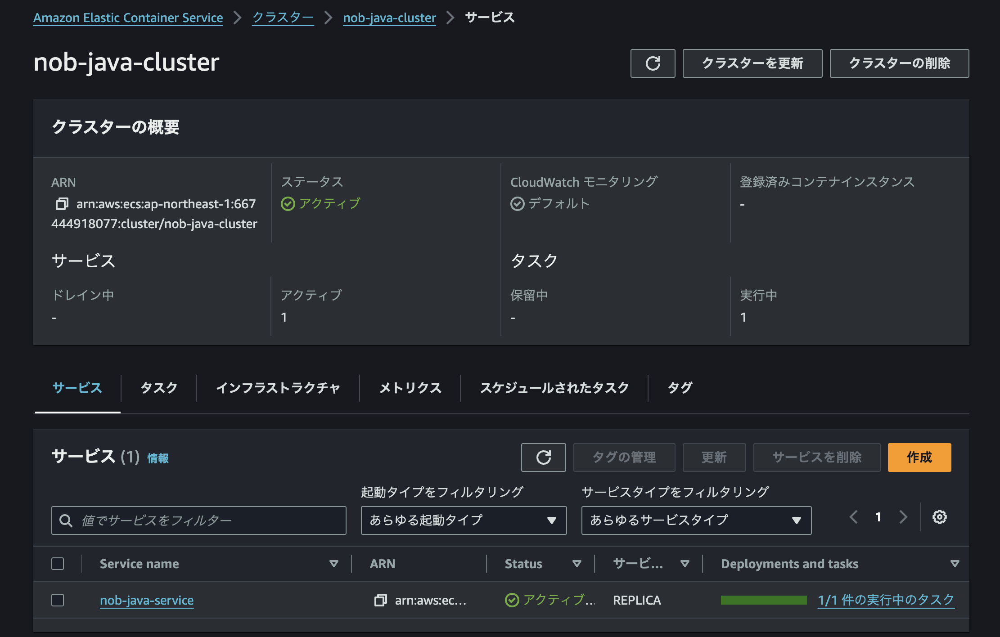

サービスが正常に作成されると、java アプリが動いていることが確認できます。

```
Nobs-MacBook-Air:~ nob$ curl 54.249.78.92:8080/sample/greet
Hello, ECS!
```

## CodePipeline

ビルド、デプロイを自動化します。

### やったこと

コンテナイメージのビルドからアプリケーションのデプロイまでを自動化し、動作確認を行います。

#### アプリ改修

動作確認のためにアプリに改修を入れます。

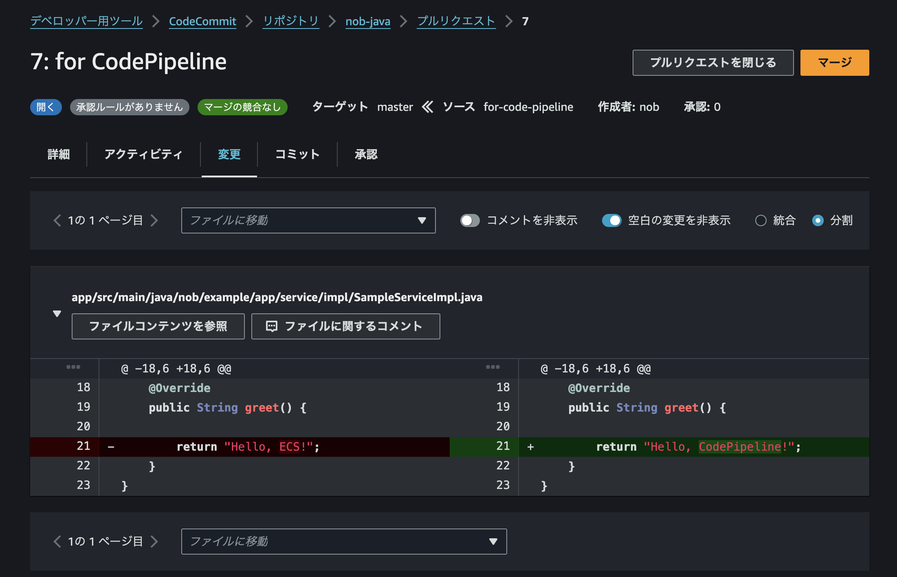

#### パイプライン作成

パイプラインの名前を指定します。

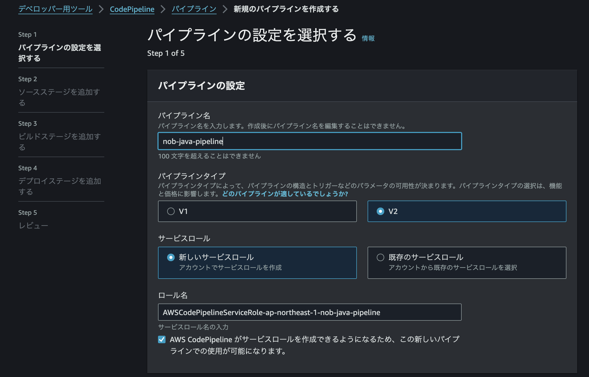

ソースを指定してソースステージを作成します。

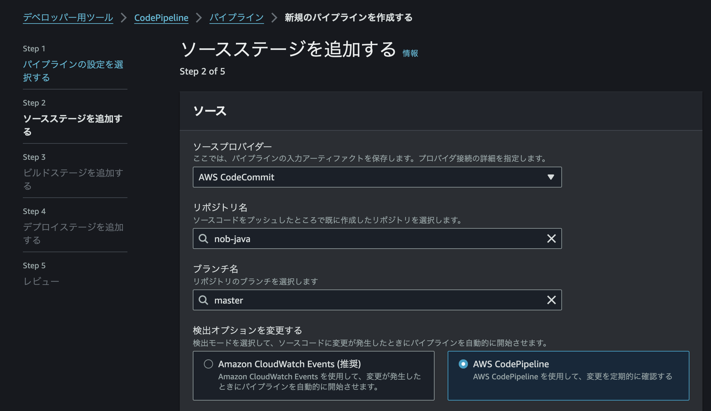

ビルドプロジェクトを指定してビルドステージを作成します。

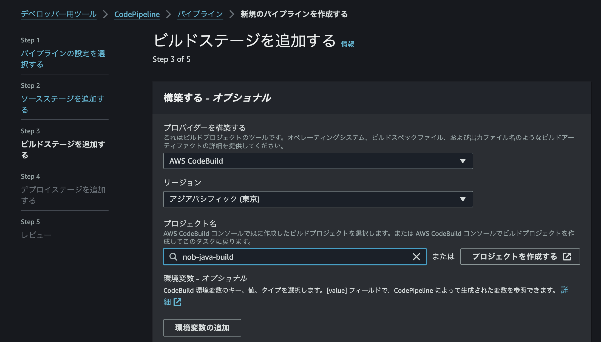

デプロイプロバイダを指定してデプロイステージを作成します。

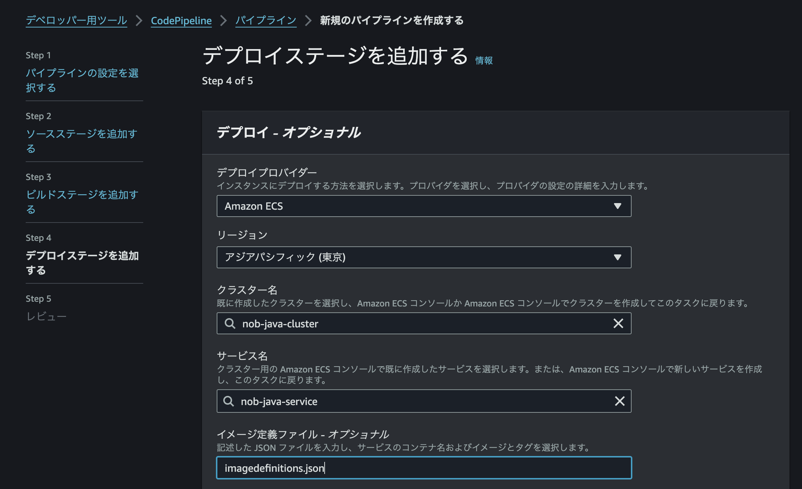

#### パイプライン実行

パイプラインの作成が完了すると、変更のリリースが始まります。

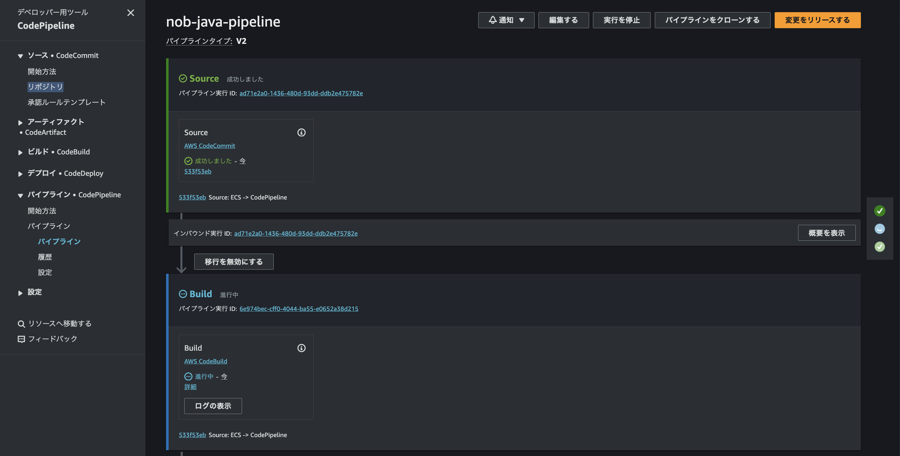

マネジメントコンソール上でパイプラインが成功したことを確認した後、再度 API を叩くと変更が反映されていることが確認できます。

```
Nobs-MacBook-Air:~ nob$ curl 13.114.42.135:8080/sample/greet
Hello, CodePipeline!
```
