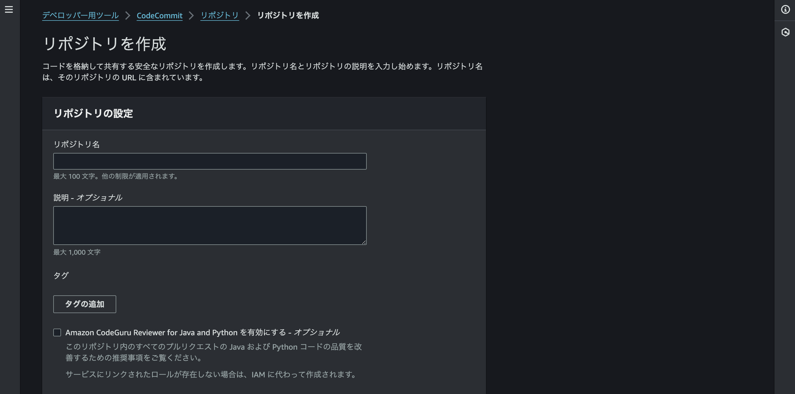
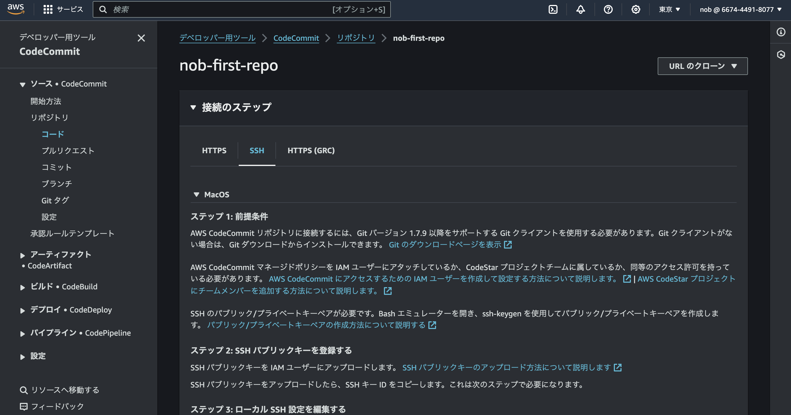
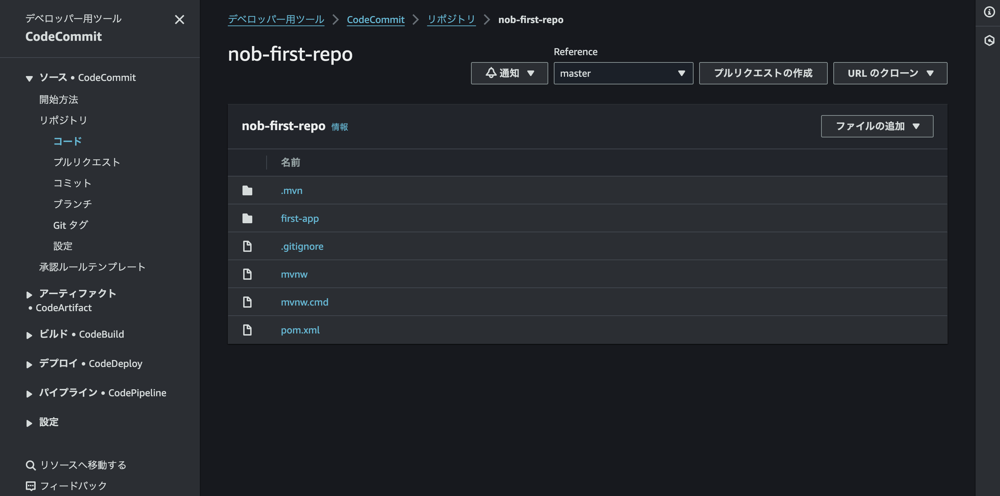
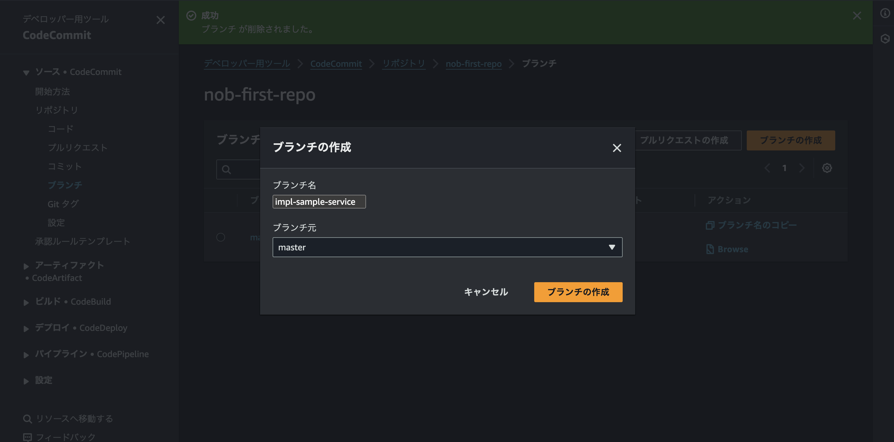
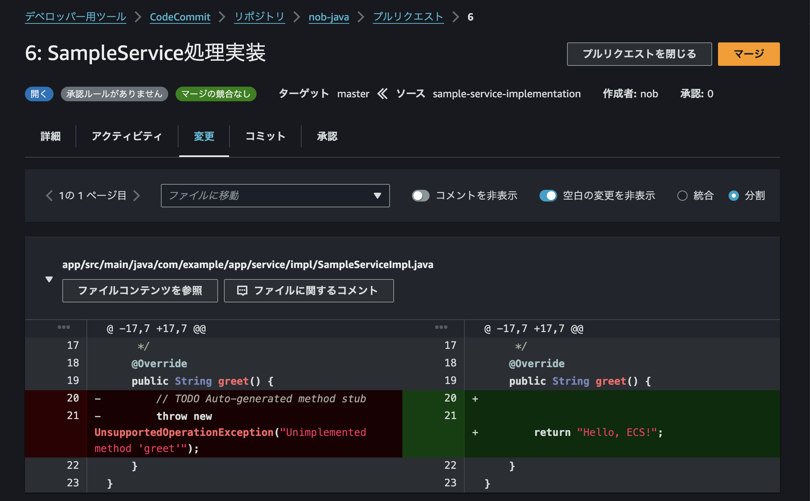
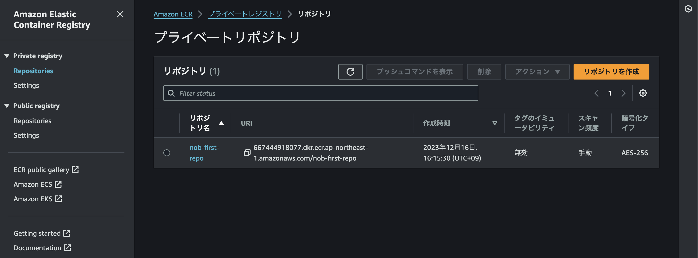
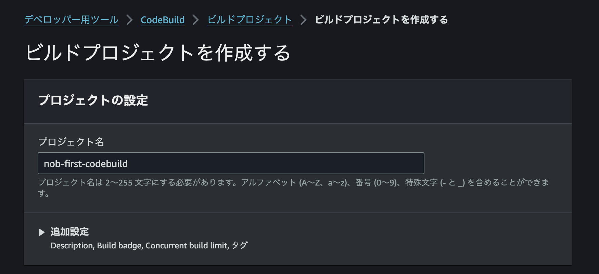
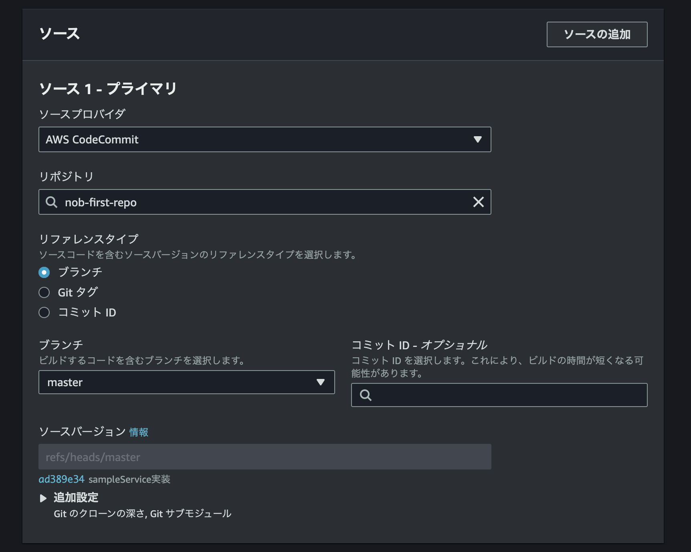
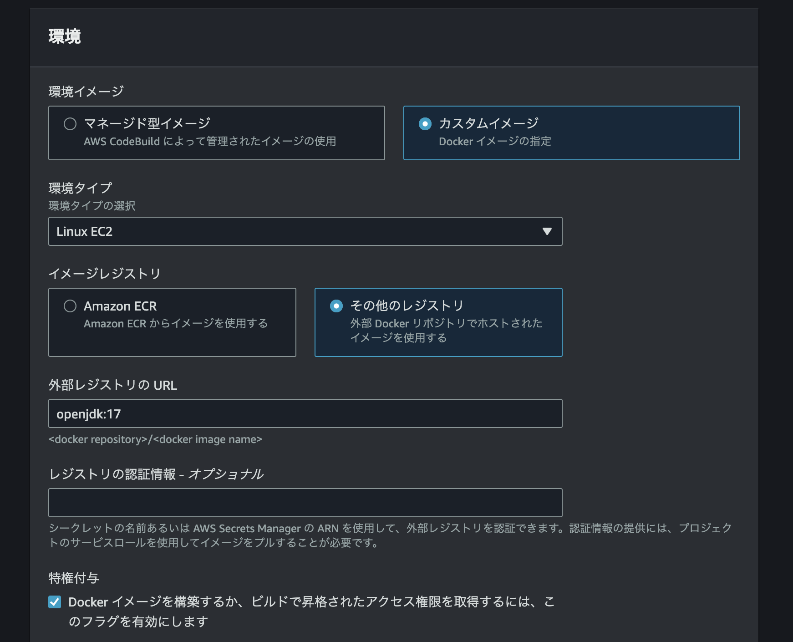

# AWS 上でソース管理からデプロイまで行う

AWS のサービスを利用しつつ、下記要領でアプリケーション開発を行います：

- CodeCommit: ソース管理
- CodeBuild: コンテナイメージの作成
- CodePipeline: アプリケーションのデプロイ

## CodeCommit

### サービス概要

**CodeCommit**サービスを利用して、AWS 上にリポジトリを立ててソース管理を行います。CodeCommit を利用するメリットとしては

- フルマネージドサービスなので可用性は AWS の責任範疇。利用者はサーバ管理などを意識する必要がない、
- 閉塞的なネットワーク内でソースを管理できる

ことがあげられます。

### やったこと

#### リポジトリ作成

AWS のコンソール上からリポジトリを作成します。リポジトリ名を指定するだけで簡単に作成できます。



リポジトリの初期ページに、SSH キーの登録方法が記載されています。ドキュメントに従ってキーを登録してクローンの準備をします。



#### ソースのプッシュ

ローカルで java プロジェクトを立ち上げ、リモートリポジトリにプッシュします。



`first-app`がアプリケーションの実体です。作業用ブランチを切ってサンプルメソッドの実装をしてみます。



ローカルでソースを編集後、プッシュしてプルリクエストを作成します。



## CodeBuild

### サービス概要

**CodeBuild**を使って、CodeCommit 上のソースからアプリケーションのモジュールをビルドします。本サービス利用のメリットとしては

- クラウド上で実行されるため、サーバリソースを気にしなくてよい

です。

### やったこと

#### ECR リポジトリ作成

アプリのコンテナイメージ格納先となる ECR リポジトリを作成します。



#### プロジェクト作成

今回はアプリのコンテナイメージ作成し、ECR にプッシュすることを目標とします。最初にビルドプロジェクトを作成します。



先ほどソースをプッシュしたリポジトリを紐づけます。



SpringBoot 提供の`mvnw`でアプリをコンパイルするので、`openjdk`を環境イメージとして選択します。



CodeBuild サービスロールにアタッチしている許可ポリシーに下記を追加して、CodeBuild から ECR に向けてイメージのプッシュができるようにします：

```json
{
    "Action": [
    "ecr:BatchCheckLayerAvailability",
    "ecr:CompleteLayerUpload",
    "ecr:GetAuthorizationToken",
    "ecr:InitiateLayerUpload",
    "ecr:PutImage",
    "ecr:UploadLayerPart"
    ],
    "Resource": "*",
    "Effect": "Allow"
},
```

また、CodeBuild の管理画面から、下記環境変数をあらかじめ設定しておきます。

| 環境変数名         | 概要                         |
| ------------------ | ---------------------------- |
| AWS_DEFAULT_REGION | リージョン名                 |
| AWS_ACCOUNT_ID     | アカウント ID                |
| IMAGE_TAG          | イメージタグ                 |
| IMAGE_REPO_NAME    | イメージ格納先リポジトリ URL |

#### buildspec 記載

CodeBuild は`buildspec.yml`に従ってビルドを進めます。この yml をソースリポジトリのルート配下に置くことで CodeBuild が認識するようになります。

```yml
version: 0.2

phases:
  pre_build:
    commands:
      - echo Logging in to Amazon ECR...
      - aws ecr get-login-password --region $AWS_DEFAULT_REGION | docker login --username AWS --password-stdin $AWS_ACCOUNT_ID.dkr.ecr.$AWS_DEFAULT_REGION.amazonaws.com
  build:
    commands:
      - echo Build started on `date`
      - echo Building the Docker image...
      - docker build -t $IMAGE_REPO_NAME:$IMAGE_TAG .
      - docker tag $IMAGE_REPO_NAME:$IMAGE_TAG $AWS_ACCOUNT_ID.dkr.ecr.$AWS_DEFAULT_REGION.amazonaws.com/$IMAGE_REPO_NAME:$IMAGE_TAG
  post_build:
    commands:
      - echo Build completed on `date`
      - echo Pushing the Docker image...
      - docker push $AWS_ACCOUNT_ID.dkr.ecr.$AWS_DEFAULT_REGION.amazonaws.com/$IMAGE_REPO_NAME:$IMAGE_TAG
```

上の設定ファイルでは

- pre_build: AWS ログイン
- build: コンテナイメージをビルド
- post_build: イメージをプッシュ

を行っています。下記 Dockerfile を使ってイメージをビルドします：

```
FROM openjdk:17

COPY ./first-app-0.0.1-SNAPSHOT.jar /app/

CMD java -jar /app/first-app-0.0.1-SNAPSHOT.jar
```

本来であれば pre_build フェーズでアプリの jar ファイルを作成するのが正攻法ですが、`aws`コマンドおよび`java`コマンドを叩ける環境イメージを用意するのが手間だったので、今回はあらかじめ jar ファイルをローカルでビルドし、プロジェクトのルートディレクトリに配置します。

#### ビルド実行

## CodePipeline

### サービス概要

### やったこと
