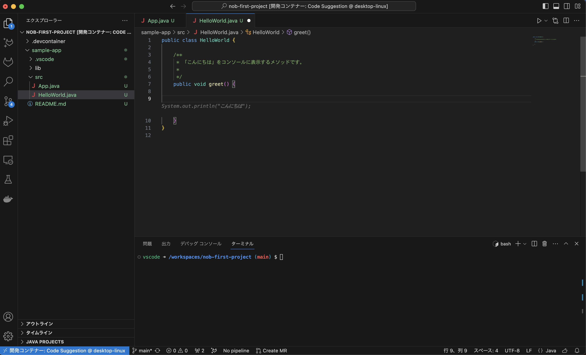
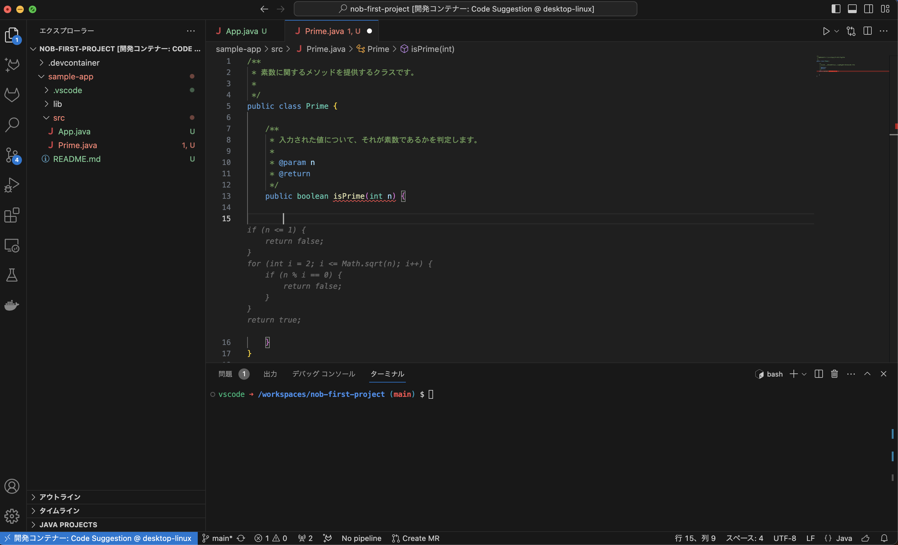
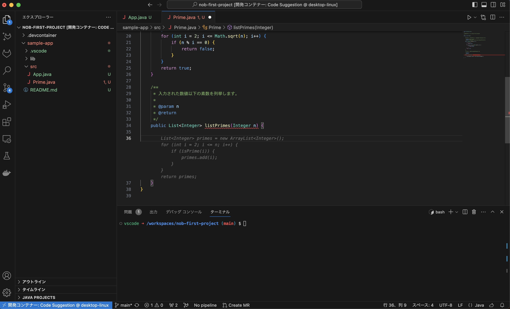
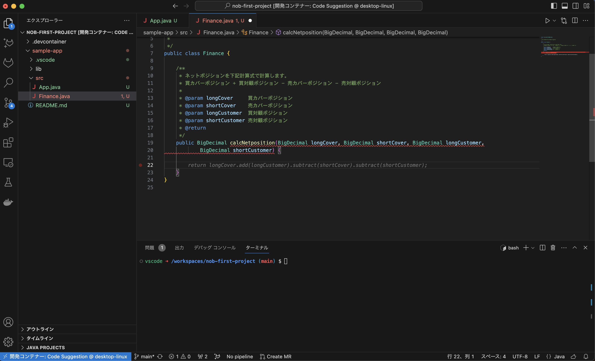

# Code Suggestions サンプル

GitLab の Code Suggestions を動かすための環境構築サンプルです。

## ディレクトリ構成

```
.devcontainer/
  ├─devcontainer.json
  └─Dockerfile
```

## 設定

あらかじめ、GitLab 側の設定で GitLab Suggestions を有効化しておいてください。下記は各種ファイルの設定内容です。

### devcontainer.json

```json
{
  "name": "Code Suggestion",

  "build": {
    "dockerfile": "Dockerfile" // 後述のDockerfileに従って起動する
  },

  "features": {
    "ghcr.io/devcontainers/features/java:1": {
      "version": "none",
      "installMaven": "true", // mvnコマンドを使えるようにする
      "installGradle": "false"
    },
    "ghcr.io/devcontainers/features/docker-in-docker:2": {} // dockerコマンドを叩けるようにする
  },
  "customizations": {
    "vscode": {
      "extensions": [
        "vscjava.vscode-spring-initializr", // Spring Boot用
        "gitlab.gitlab-workflow" // GitLab workflow
      ]
    }
  }
}
```

### Dockerfile

```Dockerfile
# microsoftから提供されているJava開発環境用イメージ
FROM mcr.microsoft.com/devcontainers/java:1-17-bullseye
```

## 例

Code Suggestions によるコード提案例です。下記以外にも、適宜 javadoc の内容を提案してくれたりとかなり親切な印象です。

### Hello world

メソッド名と javadoc コメントを書いた時点で、それに沿った実装を提案してくれました。



### 素数判定

入力値が素数であるかを判定するプログラムを提案してくれます。



### 素数列挙

入力値以下の素数を列挙するプログラムです。



### 金融関連の計算

javadoc をちゃんと書けば、それに沿った簡単な計算は提案してくれそうです。


