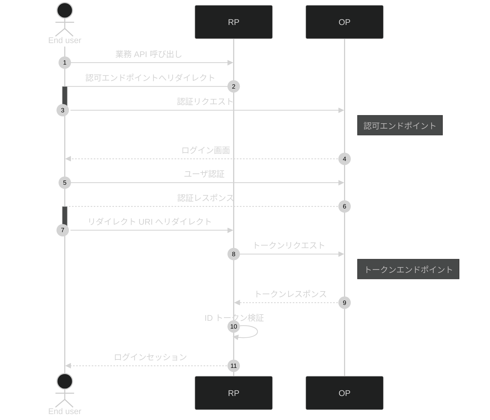

# はじめての OpenID Connect

認証・認可プロトコルの [OpenID Connect](https://openid.net/specs/openid-connect-core-1_0.html) についてその業務処理を解説します。

## 登場人物

- End user: 業務アプリケーションの利用者
- Relying party (RP): 業務アプリケーションを提供するシステム
- OpenID provider (OP): 認証を担うシステム

## シーケンス図

## 処理解説

WIP
