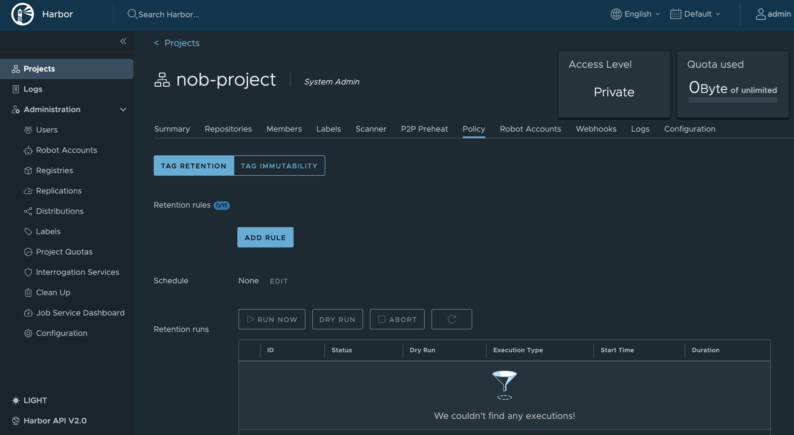
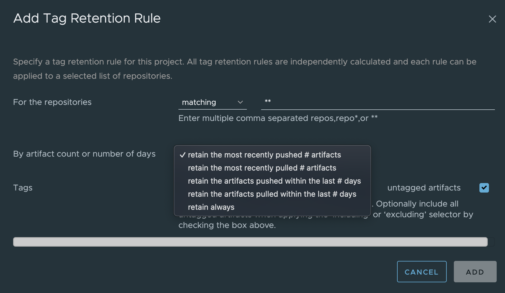

# リポジトリにライフサイクルポリシーを設定する

コンテナイメージが溜まり続けてサーバが爆発するのを防ぐために、定期的にリポジトリを掃除するポリシーを設定します。

## 設定方法

- 設定するプロジェクトを選択し、"Policy" タブに遷移します。

- "ADD RULE" からポリシーを設定します。

- "Schedule" で cron の要領で動作スケジュールを設定できます。

- "Retention runs" で動作履歴を確認できます。"RUN NOW" で即座に手動実行もできます。
