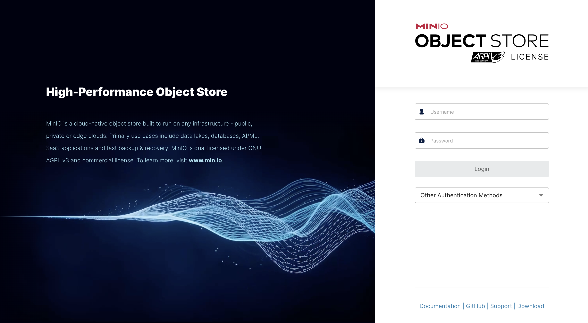
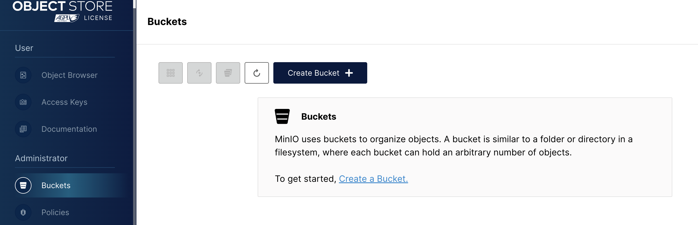
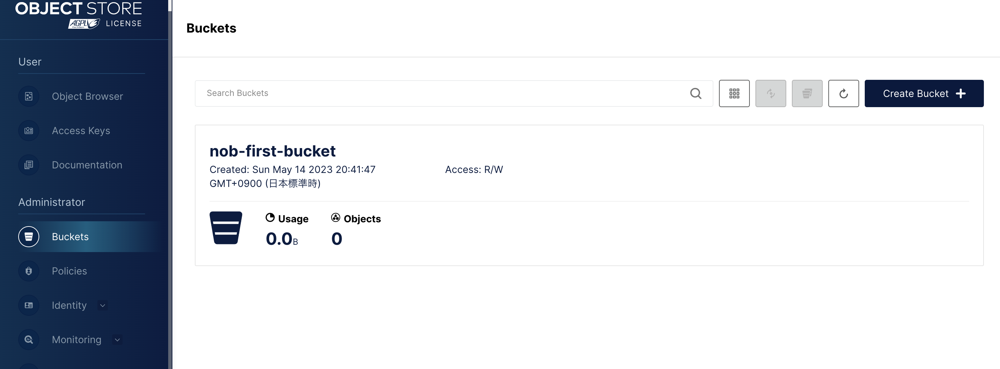
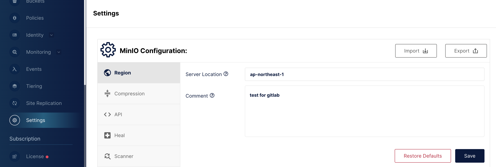
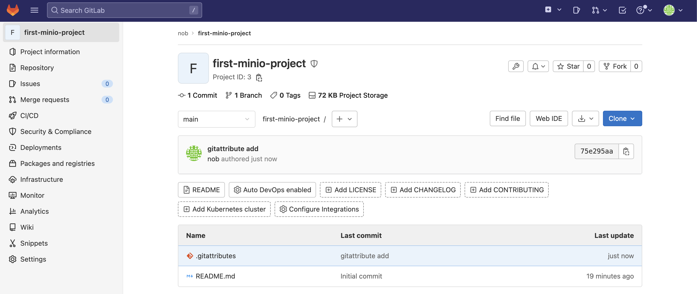
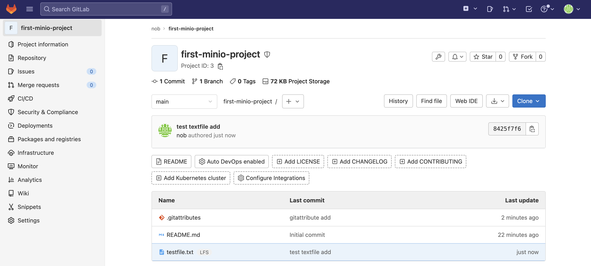
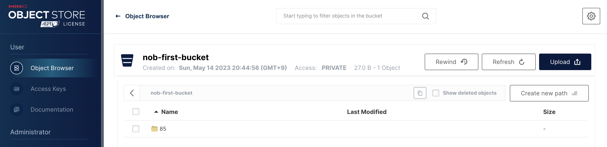

# MinIO を GitLab LFS のストレージとする

MinIO を GitLab LFS の外部ストレージとして構築・設定します。MinIO は AWS S3 と互換性があるので、基本的には AWS S3 の設定を踏襲します。

## 構築手順

### MinIO

#### 起動

MinIO を docker 上で動かすため、`docker-compose.yml`を下記で作成します：

```yml
version: "3.6"
services:
  minio:
    image: minio/minio:latest
    container_name: nob-minio
    environment:
      MINIO_ROOT_USER: root
      MINIO_ROOT_PASSWORD: password
    command: server /data --console-address ":9090"
    ports:
      - 9000:9000
      - 9090:9090
    volumes:
      - type: bind
        source: "./data"
        target: "/data"
```

`docker compose up`で起動後、`http://${MinIOサーバのIPアドレス}:9090`にアクセスするとログイン画面が表示されます。



#### バケットの作成

下記画面からバケットを作成します。名前以外はデフォルトで OK です。





#### リージョンの設定

GitLab 側から見るときに使うため、リージョンを設定します。



### GitLab

GitLab を docker で動かすため、`docker-compose.yml`を
下記で作成します：

```yml
version: "3.6"
services:
  gitlab:
    image: gitlab/gitlab-ee:15.4.2-ee.0
    container_name: nob-gitlab
    environment:
      GITLAB_OMNIBUS_CONFIG: |
        external_url "http://${GitLabサーバのIPアドレス}:80"
        gitlab_rails['gitlab_shell_ssh_port'] = 2022
      # 以下LFSの設定
        gitlab_rails['lfs_enabled'] = true
        gitlab_rails['object_store']['enabled'] = true
        gitlab_rails['object_store']['proxy_download'] = true
        gitlab_rails['object_store']['connection'] = {
          'provider' => 'AWS',
          'region' => '${MinIOで設定したリージョン}',
          'aws_access_key_id' => 'root',
          'aws_secret_access_key' => 'password',
          'endpoint' => 'http://${MinIOのIPアドレス}:9000',
          'path_style' => true
        }
        gitlab_rails['object_store']['objects']['artifacts']['bucket'] = 'gitlab-artifacts'
        gitlab_rails['object_store']['objects']['external_diffs']['bucket'] = 'gitlab-mr-diffs'
        gitlab_rails['object_store']['objects']['lfs']['bucket'] = '${バケット名}'
        gitlab_rails['object_store']['objects']['uploads']['bucket'] = 'gitlab-uploads'
        gitlab_rails['object_store']['objects']['packages']['bucket'] = 'gitlab-packages'
        gitlab_rails['object_store']['objects']['dependency_proxy']['bucket'] = 'gitlab-dependency-proxy'
        gitlab_rails['object_store']['objects']['terraform_state']['bucket'] = 'gitlab-terraform-state'
        gitlab_rails['object_store']['objects']['ci_secure_files']['bucket'] = 'gitlab-ci-secure-files'
        gitlab_rails['object_store']['objects']['pages']['bucket'] = 'gitlab-pages'
    ports:
      - "80:80"
      - "2022:22"
    volumes:
      - "/srv/gitlab/config:/etc/gitlab"
      - "/srv/gitlab/logs:/var/log/gitlab"
      - "/srv/gitlab/data:/var/opt/gitlab"
```

## 疎通確認手順

テスト用のリポジトリについて、下記コマンドで`.gitattributes`ファイルを作成して push します。

```sh
# テキストファイルを一律LFS管理とする
git lfs track "*.txt"
```



テスト用ファイルを push して、Git 側で対照ファイルが LFS 管理になっていることを確認します。



また、MinIO 側にファイルが push されていることを確認します。


